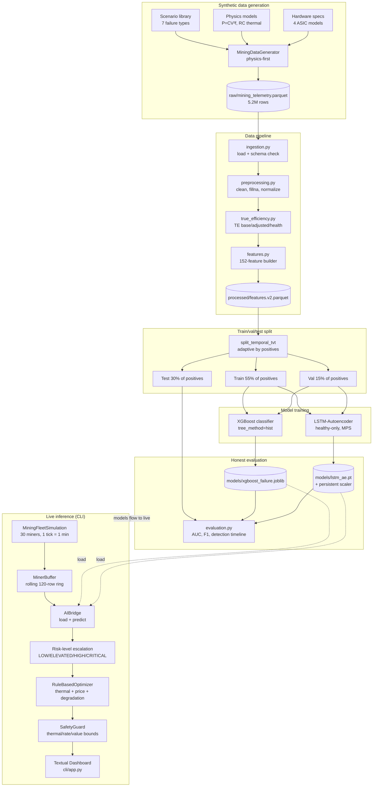
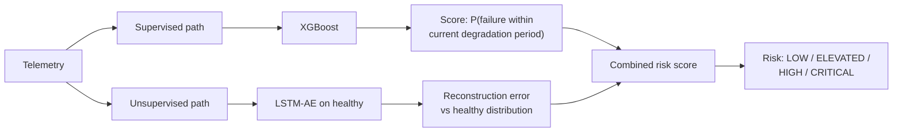
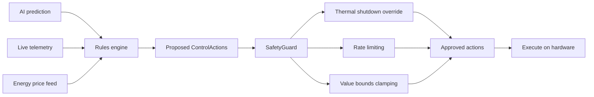

# MDK AI Mining Controller — Architecture

This document describes how the system fits together end-to-end. It is
intentionally short. For implementation details, read the source files
referenced under each section.

## High-level dataflow

## The two databases

The project keeps two separate DuckDB files on purpose:

- **`data/raw/mdk.duckdb`** — written by the batch pipeline. Holds the
  full historical telemetry table for training. Lock is acquired only
  during step 2 (ingest), released immediately so model training never
  blocks downstream readers.
- **`data/raw/mdk_live.duckdb`** — written by the live simulator.
  Per-tick rolling telemetry from the running fleet. Schema is fixed by
  `_LIVE_TELEMETRY_DDL` in `src/storage/backend.py` so the table exists
  on first open even with `ensure_live_schema=True`.

If you ever see a hang on `duckdb.connect()`, the storage layer raises
a `RuntimeError` with the holder PID via `lsof` instead — read the
error, kill the holder, retry. Never delete the `.wal` file by hand;
DuckDB recovers it automatically on the next clean open.

## The two models, and why both

**Supervised XGBoost** is the primary detector when failure types in
production resemble training. It produces calibrated probabilities and
ranks the most informative features so an operator can ask "why was
this flagged".

**Unsupervised LSTM-Autoencoder** is the safety net for novel failure
patterns. Trained on healthy-only sequences, it flags anything whose
reconstruction error exceeds a percentile threshold calibrated on
held-out healthy validation data. It catches failure types XGBoost was
never trained on (the validation script explicitly tests this).

A combined risk score weights both 65/35 in favor of XGBoost, then
escalates to operator-facing risk levels via a sustained-duration
filter (10 min above floor → ELEVATED, 30 min → HIGH, 60 min →
CRITICAL).

## Safety-first control loop

Every action flows through `SafetyGuard.check_action()` before it can
reach the hardware. Three checks are non-negotiable:

1. **Thermal shutdown override.** If `temperature_c >= 95C`, the
   guard rejects any action that isn't a maintenance flag. Even an
   AI-predicted "boost frequency" is dropped if the chip is too hot.
2. **Rate limiting.** No `set_*` action within
   `min_change_interval_seconds` (default 300s) of the last action
   for the same miner. Prevents oscillation and PID-style instability.
3. **Value clamping.** `set_frequency` and `set_voltage` are
   clamped to `[freq_min, freq_max]` and `[voltage_min, voltage_max]`
   from the per-miner spec. The model can never accidentally request
   a value outside hardware tolerances.

The guard also exposes `enforce_thermal_shutdown()` for use as a
top-level emergency hook even when no AI prediction is involved.

## Key file map

| Concern | File |
|---|---|
| End-to-end training pipeline | `src/run_pipeline.py` |
| Synthetic data generation | `src/synthetic/generator.py` |
| Failure scenario library | `src/synthetic/scenarios.py` |
| Feature engineering (152 cols) | `src/pipeline/features.py` |
| Adaptive temporal split | `src/pipeline/features.py:split_temporal_tvt` |
| True Efficiency KPI | `src/kpi/true_efficiency.py` |
| XGBoost classifier | `src/models/xgboost_classifier.py` |
| LSTM-AE + persistent scaler | `src/models/lstm_autoencoder.py` |
| Threshold selectors | `src/models/evaluation.py` |
| Rule-based optimizer | `src/optimizer/rules.py` |
| Safety guard | `src/optimizer/safety.py` |
| DuckDB store with lock recovery | `src/storage/backend.py` |
| Textual dashboard | `src/cli/app.py` |
| Live fleet simulator | `src/cli/simulation.py` |
| Live AI bridge | `src/cli/ai_bridge.py` |
| Validation runner | `src/validate.py` |

## Performance characteristics

Measured on Apple Silicon M-series at the 30 × 120 scale (5.2 M rows,
152 features, 16 failing miners):

| Step | Wall clock |
|---|---|
| 1. Synthetic generation | ~110 s |
| 2. DuckDB ingest | ~2 s |
| 3. Preprocessing | ~15 s |
| 4. TE KPI computation | ~5 s |
| 5. Feature engineering | **~25 min (cold) / instant (cache hit)** |
| 6. Adaptive train/val/test split | < 1 s |
| 7. XGBoost training | ~5-7 min |
| 8. LSTM-AE training (MPS) | ~30-80 min depending on early stop |

The feature cache (`data/processed/features.v{N}.parquet`) is the
biggest single iteration speedup. Only invalidated when the raw parquet
is regenerated or when `FEATURES_VERSION` is bumped.

## What this is not

- Not a production system. No model versioning, no drift detection,
  no canary deployment, no online learning.
- Not connected to real ASIC telemetry. The MDK integration layer
  (data ingestion from real workers) is left as future work — the
  pipeline is structured to make that swap straightforward.
- Not an RL controller. The optimizer is intentionally rule-based for
  safety and auditability. Migration path to learned policies is
  documented in `docs/PROPOSAL.md`.
