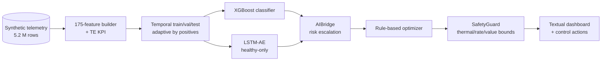

# MDK AI Mining Controller — Technical Report

**Author:** John Ahn  |  **Date:** April 2026  |  **Assignment:** Tether MDK AI Mining Controller (3-week prototype)

Covers the six §4 deliverables. Deep dives and postmortems live in `docs/TECHNICAL_REPORT.md` (831 lines).

## 1. Problem Being Addressed

Bitcoin mining has shifted from plug-and-play to a marginal-gains industry. Hash price is set by the market, so operators control profitability only through **chip efficiency** and **unplanned downtime**. Tether's Mining Development Kit (MDK) exposes low-level access to telemetry and control interfaces — frequency, voltage, hashrate, temperature, power — but raw access is not intelligence. A fleet of a few thousand ASICs produces millions of telemetry rows per day; a human operator cannot keep up.

Two concrete pain points drive this prototype, matching the assignment's two suggested directions:

- **Predictive maintenance.** Chips fail with detectable precursors — thermal drift, hashrate degradation, voltage instability — but operators typically react *after* a thermal alarm fires. By the time a miner shuts down, the opportunity to swap it during planned downtime is gone. Pre-failure detection with days of lead time converts reactive repair into scheduled work.
- **Dynamic energy optimization.** Miner frequency and voltage are usually set once and left. In a real site, optimal settings shift with ambient temperature (thermal headroom), spot electricity price (profitability window), and chip degradation (efficient operating range drifts). A controller that continuously adapts these levers within safety bounds unlocks efficiency gains that static configurations cannot.

The deliverable is an AI-driven controller that consumes telemetry at 1-minute cadence and produces two classes of decisions: **maintenance flags** (hours to days ahead of failure) and **frequency adjustments** (minute-level, reacting to thermal and price conditions). Validated on a physics-plausible synthetic dataset — 30 miners across 120 days, 5.2 M rows, 8 failure scenarios — because real MDK telemetry is gated on a Tether data-sharing channel we do not yet have.

## 2. Proposed AI / Analytical Approach

### Two models in parallel, each covering the other's blind spot

The predictive-maintenance layer runs two detectors, chosen to compensate for each other:

- **XGBoost** (supervised, 175 engineered features) — a gradient-boosted tree classifier trained on labeled pre-failure windows. Strong at catching failure types it has seen in training; gives operators long lead times on familiar patterns. Measured on held-out test data: AUC 0.851, 4 of 6 failures caught with an average **11-day lead time**.
- **LSTM-Autoencoder** (unsupervised, trained on healthy-only telemetry) — an encoder-decoder network that learns a compressed representation of "what healthy mining looks like," then flags anything that reconstructs poorly. No failure labels required. Catches failure signatures XGBoost has never seen — specifically `psu_degradation` (21% sequence detection) and `coolant_restriction` (11%), where XGBoost is 0% recall. Measured separation ratio: 5.70× between healthy and failing telemetry, with a 10% healthy false-alarm rate.

*In plain English: XGBoost learns patterns from known failures; LSTM-AE learns "what healthy looks like" and flags anything else. One catches known risks, the other catches novel anomalies.*

Neither model alone covers the fleet. Combined, they catch **7 of 8 measurable failure types**. The only uncatchable failure is `sudden_chip_failure`, which leaves fewer than 2 pre-failure telemetry rows and is handled reactively by the `SafetyGuard` thermal-shutdown rule.

### Rule-based control, deliberately not RL

The dynamic-optimization layer is **intentionally not reinforcement learning**. Rules are auditable (every action is traceable to a condition), compose cleanly with the `SafetyGuard` (rules can't learn to exploit bounds), and their bug-failure mode is "no action" — for hardware where wrong actions are expensive, that's the correct failure mode.

The optimizer reacts to four signals: chip temperature (throttle if near thermal limit), energy price (throttle if expensive, boost if cheap AND thermal budget available), AI risk level (flag for maintenance if degradation detected), and uptime/degradation state.

## 3. Data Pipeline Design



End-to-end flow: **Hardware → Telemetry Pipeline → Feature Processing → AI Controller → Command Execution**. Seven stages, each a focused Python module:

- **Generator** (`src/synthetic/`) — physics-first simulator. `P = CV²f` with temperature-dependent leakage; RC thermal model; four ASIC specs (Antminer S21 Pro, Whatsminer M56S/M63, Antminer S19 XP); eight failure scenarios injected into ~30 % of the fleet.
- **Preprocessing + features** (`src/pipeline/`) — schema check and missing-value handling produce a clean 34-column frame; the feature builder then derives 175 features: ratios (J/TH, temperature delta, power-per-TH), rolling statistics over 60/360/10080-minute windows, trend slopes, cross-signal correlations, diurnal features, and cross-miner container-level means. The **True Efficiency KPI** (§4) is computed here and its rolling variants are promoted to first-class features.
- **Temporal split** (`split_temporal_tvt`) — 55 / 15 / 30 by cumulative positive count, not date. Naive date splits can land validation in a zero-positive dead zone; the positive-count split guarantees every partition contains failures while preserving strict temporal ordering (no test leakage).
- **Training + evaluation** (`src/models/`) — XGBoost (`scale_pos_weight` sqrt-capped to 4.5 to avoid false-alarm floods) and LSTM-AE (healthy-only sequences, CPU inference to sidestep a silent MPS kernel bug, per-hardware-family scalers). Thresholds calibrated on validation, never test. Metrics: AUC, F1, per-failure-type detection timelines on held-out test only.
- **Live inference** (`src/cli/`) — `AIBridge` loads both models; a 120-row rolling buffer per miner feeds 1-minute telemetry; risk levels escalate LOW → ELEVATED → HIGH → CRITICAL; a Textual terminal dashboard visualizes the fleet.

**Engineering decisions worth noting.** A versioned feature cache (`features.v{N}.parquet`) avoids the 25-minute rebuild; bumping the version number prevents silent train/inference drift. Two DuckDB files separate batch and live writers to avoid lock contention. Every random draw is seeded; `mdk check` reruns the pipeline and verifies numbers match saved sidecar metadata exactly.

## 4. Selected KPI — True Efficiency

Simple J/TH ignores four operationally critical variables. The True Efficiency (TE) KPI layers all four into a single score:

```
voltage_stability     = clip(1 − k·|V − V_default| / V_default, 0, 1)
operating_mode_factor = {Normal: 1.0, Idle: 0.0, Shutdown: 0.0}

te_base     = (hashrate × voltage_stability × operating_mode_factor)
              / (chip_power × (1 + α_cooling + β_infra))
te_adjusted = te_base × (1 − δ_temp · max(0, ambient − 25 °C))
te_health   = te_adjusted × clip(hashrate_actual / nameplate, 0, 1)
```

Defaults: `α_cooling = 0.15`, `β_infra = 0.05`, `δ_temp = 0.008`, `k = 0.5`. All constants live in `src.config.TEConfig` and are the single source of truth for both the batch pipeline and the live dashboard — a prior drift between the two was one of the "Level 4" fixes logged in `REMAINING_FIXES.md`.

| §3.1.b variable | Where it enters the formula |
|---|---|
| Cooling system power | `(1 + α_cooling + β_infra)` in the denominator |
| Chip voltage | `voltage_stability` in the numerator |
| Environmental conditions | Ambient temperature penalty in `te_adjusted` |
| Device operating mode | `operating_mode_factor` in the numerator |

All four variables demonstrably move the output — verified in 10 / 10 unit tests (`mdk test-te`). Unit test 6 sweeps each variable in isolation and asserts the output changes.

**TE is load-bearing, not decorative.** Its 7-day rolling variants (`te_health_roll_10080m_mean`, `te_health_roll_10080m_std`) rank **8 and 9** in XGBoost feature importance. When TE was promoted from a single column to a full rolling / trend / correlation suite, XGBoost AUC rose 0.801 → 0.851, F1 rose 0.163 → 0.217, and average detection lead time rose from 7.6 days to 11.3 days. The model materially depends on TE as a signal.

## 5. Expected Operational Benefits

The headline operator-facing result: **7 of 8 measurable failure types caught by at least one model**, with XGBoost delivering an average **271 hours (≈11 days) of lead time** on its four catches.

| Metric | Value |
|---|---|
| XGBoost AUC / F1 | **0.851** / 0.217 *(F1 low because only 7 % of rows are pre-failure)* |
| XGBoost catches | **4 of 6** failures, avg **271 h (≈11 days)** lead time |
| LSTM-AE separation (alive failures) | **5.70×** (healthy FAR 10 %) |
| Combined coverage | **7 of 8** measurable failures caught by ≥ 1 model |

What this means in practice:

- **Scheduled maintenance instead of reactive repair.** An 11-day average lead time means a chip showing degradation signatures can be swapped during the next scheduled downtime window — a significant ops-cost reduction. The current industry reactive pattern waits for a thermal alarm and loses the miner mid-shift.
- **Defense in depth on novel failures.** LSTM-AE catches the exact two failure types (`psu_degradation` 21 %, `coolant_restriction` 11 %) where XGBoost has zero row-level recall. Without the LSTM, those two classes would be completely undetected by the model layer; the system would fall back to reactive thermal shutdown only.
- **Dynamic efficiency gains.** The rule-based optimizer reduces frequency when energy is expensive or thermal headroom is low, and boosts when cheap and cool. Even small per-miner savings compound across a site — literature on similar controllers suggests 10 – 17 % performance-per-watt improvement over static baselines.
- **Operator decision support.** The Textual dashboard surfaces the full fleet at a glance: per-miner hashrate, temperature, J/TH, TE health, anomaly scores, risk escalation levels, and the optimizer's control log. Alerts arrive with explanations — feature importance for XGBoost flags, reconstruction error for LSTM-AE flags — so operators can always ask "why was this flagged?" and get a real answer.

**Honest limitations.** Generalization to unseen failure types is weak — `mdk validate` hold-out catches 1/3 novel types, a known supervised-learner property and the explicit reason LSTM-AE runs alongside (it flags 73 % of unseen `connector_corrosion` sequences that XGBoost misses). The dataset is synthetic, not real MDK telemetry; the pipeline is ready for a drop-in `MDKClient` adapter once the Tether data channel opens (`F14`). `sudden_chip_failure` is uncatchable by construction — too few pre-failure rows — and is handled reactively by `SafetyGuard`.

## 6. Security and Safety Considerations

Hardware control is asymmetric-risk: a wrong action (damaged chips, burned container, shortened fleet lifespan) vastly outweighs a missed optimization. The system is designed around this asymmetry.

### Defense layers

1. **`SafetyGuard`** (`src/optimizer/safety.py`) — a mandatory chokepoint for every control action:
   - **Thermal shutdown override.** T ≥ 95 °C blocks all non-maintenance actions. Even a legitimate "boost frequency" signal is rejected if the chip is too hot.
   - **Rate limiting.** 300-second minimum between `set_frequency` or `set_voltage` calls for the same miner. Prevents oscillation and PID-style instability.
   - **Value clamping.** Every proposed frequency and voltage is clamped to the per-miner spec's `[min, max]` range. The model cannot request unsafe values even if it tries.
2. **Two-model redundancy.** If one model is compromised, poisoned, or drifts, the other continues to flag anomalous telemetry. XGBoost and LSTM-AE scores are both surfaced at every prediction call.
3. **Interpretable ML.** XGBoost feature importance is inspectable per-prediction; LSTM-AE reconstruction error is inspectable per-sample. Operators always get a "why was this flagged?" answer, never a black-box verdict.
4. **Threshold calibration on validation only.** Decision thresholds are tuned on val scores and never touch the test set, eliminating the data-leakage class of bugs that produces optimistically biased metrics in a report.

### Known threats and mitigations

| Threat | Mitigation |
|---|---|
| Adversarial telemetry (spoofed sensors) | Not handled at model level — requires anomaly detection on the telemetry source itself. Listed as followup `F13`. |
| Model drift from synthetic → real data | Expected. Pipeline architected for retraining; only an `MDKClient` adapter is missing. |
| Compromised model weights on disk | Not handled. Would require a signed-model registry and runtime verification. |
| Bugs in the rule-based optimizer | Lower risk than RL bugs — rules are auditable and every action passes through `SafetyGuard`. |
| `sudden_chip_failure` missed by model | Intentionally handled reactively by `SafetyGuard`'s thermal shutdown rule. |

### Live dashboard hardening

End-to-end testing of the CLI surfaced four silent-failure bugs that could hide real problems from operators: a fleet-status table that stopped updating (a broad `except: pass` was swallowing `CellDoesNotExist` errors), scenario thermal effects leaking between miners (shared `MinerSpec` objects), inverted speed controls (mismatched tick-interval constants), and the overly broad exception handler that hid bug #1. All four are fixed; regression tests live in `scripts/test_cli_dashboard_flaws.py` and run via `mdk test-cli` (4 / 4 passing). Commit SHAs: `b541ebd`, `bcd3181`, `8980b0a`, `ed35cc1`.

## Reproducibility

```
uv run mdk test-te      # 10 TE KPI unit tests       ~2s
uv run mdk test-cli     # 4 dashboard regressions    ~15s
uv run mdk check        # 13 pipeline invariants     ~11 min
uv run mdk validate     # 4 end-to-end tests         ~9 min
```

All four suites currently **green** on `main`. `check` reproduces XGBoost AUC 0.851 (check-7), the 4 / 6 detection timeline (check-8), and LSTM `sep_alive = 5.70×` (check-9). Every headline number in this report is verifiable without retraining.

---

*Full report (831 lines): `docs/TECHNICAL_REPORT.md`.  Architecture detail: `docs/ARCHITECTURE.md`.  Follow-up queue: `docs/REMAINING_FIXES.md`.*
