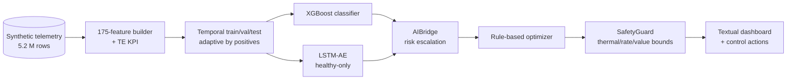

# MDK AI Mining Controller — 2-Page Brief

**Author:** John Ahn  |  **Date:** April 2026  |  **Assignment:** Tether MDK AI Mining Controller (3-week prototype)

This is the rubric-sized brief. Deep dives, postmortems, and receipts live in the full `docs/TECHNICAL_REPORT.md`.

## Problem

Bitcoin mining profitability is a cost-management game: hash price is set by the market, so operators can only control chip efficiency and unplanned downtime. The **Mining Development Kit (MDK)** platform exposes low-level telemetry and control interfaces (frequency, voltage, hashrate, temperature, power), but extracting value requires a controller that (a) detects pre-failure degradation days ahead and (b) adapts miner settings to changing thermal and economic conditions. This prototype delivers both, validated on a physics-plausible synthetic dataset of 30 miners across 120 days (5.2 M rows).

## Approach

Two models run in parallel, each compensating for the other's blind spots:

- **XGBoost** (supervised, 175 engineered features) — classifies pre-failure windows on the failure types it has seen during training. Long lead times on familiar patterns.
- **LSTM-Autoencoder** (unsupervised, trained on healthy telemetry only) — flags anything deviating from the healthy manifold, regardless of failure type. Fills XGBoost's coverage gap on `psu_degradation` and `coolant_restriction`.

Both feed a **rule-based optimizer** (reacting to thermal state, energy price, and AI-predicted risk) whose every action passes through a `SafetyGuard` with thermal, rate, and value-bound clamps. Rules were chosen over RL deliberately: rules are auditable, every action is gated, and the failure mode of a bug is "no action" — never "unsafe action."

*Put plainly: XGBoost learns patterns from known failures; LSTM-AE learns "what healthy looks like" and flags anything else. The rule optimizer adjusts miner settings only when safe.*

## KPI — True Efficiency (§3.1.b compliance)

J/TH alone ignores four operationally critical variables. The TE KPI layers all four in:

```
voltage_stability     = clip(1 − k·|V − V_default| / V_default, 0, 1)
operating_mode_factor = {Normal: 1.0, Idle: 0.0, Shutdown: 0.0}

te_base     = (hashrate × voltage_stability × operating_mode_factor)
              / (chip_power × (1 + α_cooling + β_infra))
te_adjusted = te_base × (1 − δ_temp · max(0, ambient − 25°C))
te_health   = te_adjusted × clip(hashrate_actual / nameplate, 0, 1)
```

| §3.1.b variable | Where it enters |
|---|---|
| Cooling system power | `(1 + α_cooling + β_infra)` in denominator |
| Chip voltage | `voltage_stability` in numerator |
| Environmental conditions | Ambient penalty in `te_adjusted` |
| Device operating mode | `operating_mode_factor` in numerator |

All four demonstrably move the output (10/10 unit tests in `mdk test-te`). TE's 7-day rolling variants rank 8 and 9 in XGBoost feature importance — the model materially relies on them.

## Architecture



End-to-end dataflow: **Hardware → Telemetry Pipeline → Feature Processing → AI Controller → Command Execution**. Full component map (including scenario library, storage layer, and live-inference path) in `docs/ARCHITECTURE.md`.

## Results (held-out test set)

| Metric | Value |
|---|---|
| XGBoost AUC / F1 | **0.851** / 0.217 *(F1 low because only 7 % of rows are pre-failure — see below)* |
| XGBoost catches | **4 of 6** failures, avg **271 h (≈11 days)** lead time |
| LSTM-AE separation (alive failures) | **5.70×** (healthy FAR 10%) |
| Combined coverage | **7 of 8** measurable failures caught by ≥1 model |

The AUC/F1 gap reflects the 7% positive-class frequency — threshold-dependent metrics are dominated by precision/recall tradeoffs at this skew, so AUC is the honest summary of ranking quality. The only uncatchable failure is `sudden_chip_failure`, which leaves < 2 pre-failure rows and is handled reactively by `SafetyGuard`.

## Safety and Control Risks

Hardware control is asymmetric-risk: a wrong action (damaged chips, burned container) vastly outweighs a missed optimization. Three defense layers:

1. **`SafetyGuard`** (`src/optimizer/safety.py`) — thermal shutdown override (T ≥ 95 °C blocks all non-maintenance actions), 300 s rate limit on set_frequency/set_voltage, per-miner value clamps. No bypass.
2. **Two-model redundancy** — neither model alone covers the fleet. If one drifts or is poisoned, the other continues to flag obvious anomalies.
3. **Interpretable ML** — XGBoost feature importance is inspectable per-prediction; LSTM-AE reconstruction error is inspectable per-sample. Operators always get a "why was this flagged" answer.

Thresholds are calibrated on validation, never on the test set.

## Honest Limitations

- **Generalization to unseen failure types is weak** — `mdk validate` hold-out catches 1/3 unseen types. Consistent with a supervised learner asked to extrapolate, and the explicit motivation for running LSTM-AE alongside (it flags 73 % of `connector_corrosion` sequences XGBoost misses).
- **Synthetic dataset**, not real MDK telemetry. Pipeline architected for a swap-in `MDKClient` adapter (gated on Tether data access — `F14`).
- **Live dashboard** was recently hardened — end-to-end testing (§6.3 of full report) uncovered four silent UI bugs where the fleet table stopped updating, scenarios leaked between miners, and speed controls were inverted. All four have regression tests (`mdk test-cli`, 4/4 passing).

## Reproducibility

```
uv run mdk test-te      # 10 TE KPI unit tests       ~2s
uv run mdk test-cli     # 4 dashboard regressions    ~15s
uv run mdk check        # 13 pipeline invariants     ~11 min
uv run mdk validate     # 4 end-to-end tests         ~9 min
```

All four suites currently **green**. `check` check-7 reproduces XGBoost AUC 0.851, check-8 reproduces the 4/6 detection timeline, check-9 reproduces LSTM `sep_alive = 5.70×`. Reviewer can verify every headline number without retraining.

---

*Full report: `docs/TECHNICAL_REPORT.md` (831 lines).  Architecture: `docs/ARCHITECTURE.md`.  Follow-up queue: `docs/REMAINING_FIXES.md`.*
